Nama  :  Kaleb Suy

NIM   :  312110390

Kelas :  TI.21.B.2

Tugas :  Pemrograman Web1 (Pertemuan 4)

# Lab3Web
## 1. Membuat List
## 1.1 Membuat Ordered List
Tambahkan kode untuk membuat Ordered List seperti berikut
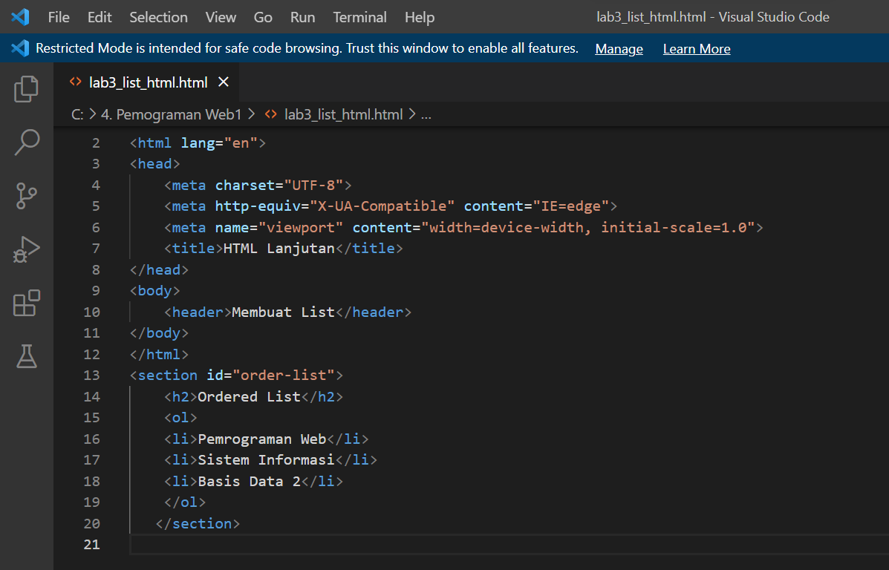

Setelah itu buka file pada browser dan lihat hasilnya

Tampilan Ordered List pada browser
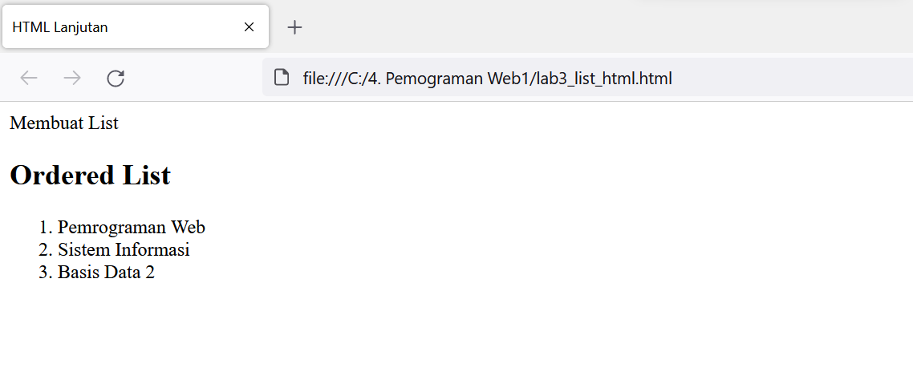

## 1.2 Membuat Unorderedd List
Tambahkan kode untuk membuat Unordered List, setelah deklarasi ordered list pada 
section unordered-list, seperti berikut

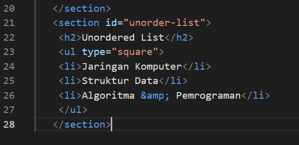

Kemudian refresh browser dan lihat perubahannya

Tampilan Unordered List pada browser
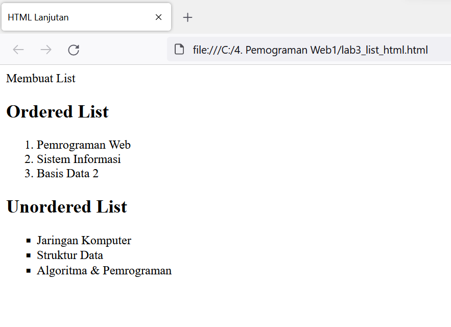

## 1.3 Membuat Description List
Tambahkan kode untuk membuat description list setelah deklarasi unorderd-list

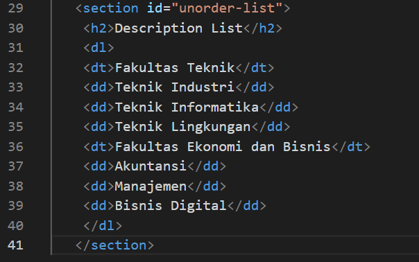

Tampilan Description List pada browser setelah direfresh
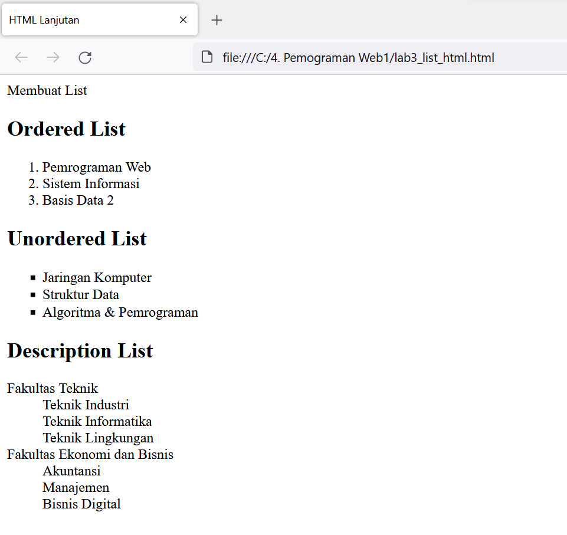

### 2. Membuat Tabel
Tambahkan kode untuk membuat tabel sederhana seperti berikut:
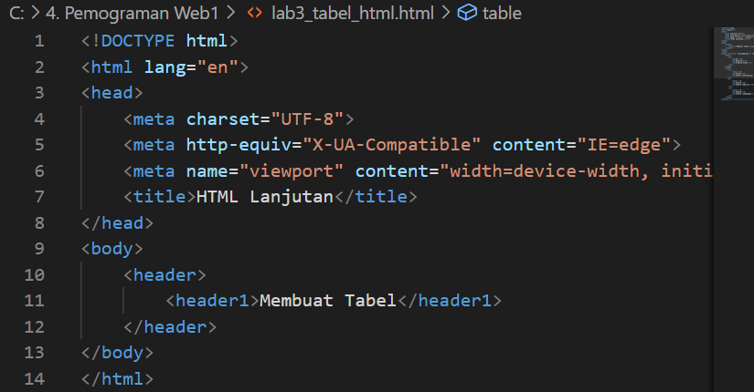
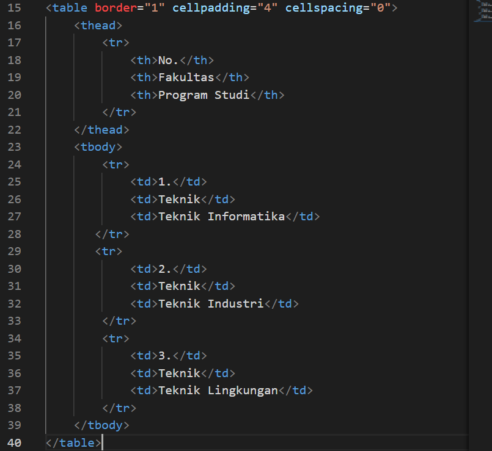

### 2.1 Mengatur Margin dan Padding
Untuk mengatur margin dan padding pada cel data, tambahkan atribut cellpadding dan 
cellspacing pada tag table

<table border="1" cellpadding="4" cellspacing="0">

Tampilan tabel pada browser
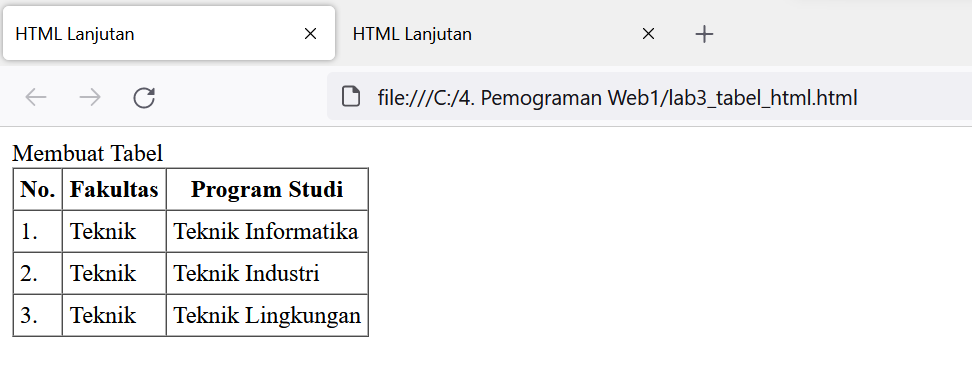

### 2.2 Menggabungkan Sel Data
Untuk menggabungkan sel data, gunakan atribut rowspan dan colspan. Atribut rowspan untuk 
menggabungkan baris (secara vertikal) dan colspan untuk menggabungkan kolom (secara 
horizontal).

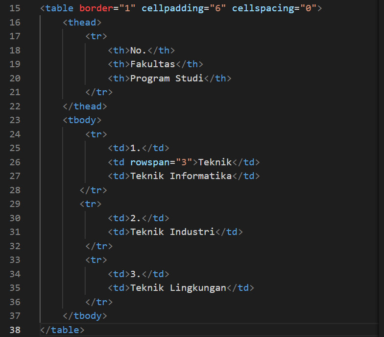

Tampilan Penggabungan Sel pada browser
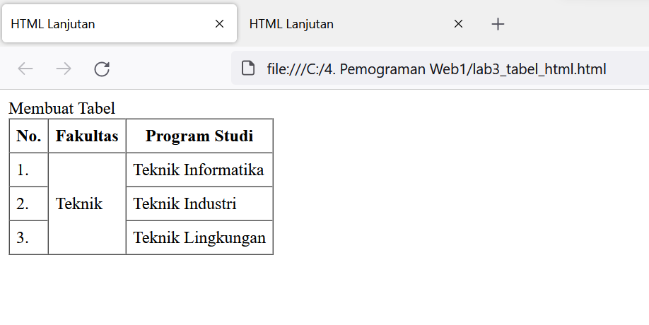

#### 3. Membuat Form
Buat file baru html seperti berikut:
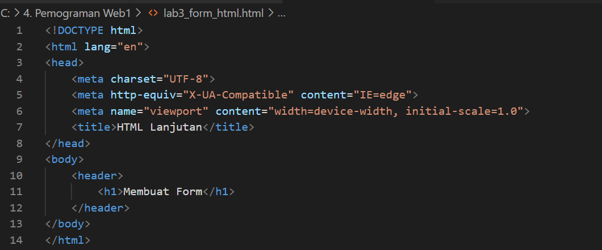

Kemudian tambahkan kode untuk membuat tabel sederhana seperti berikut:

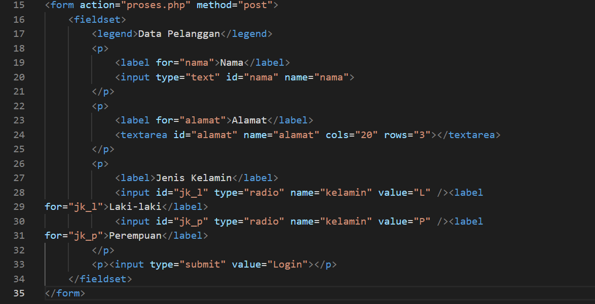

Tampilan Form pada browser
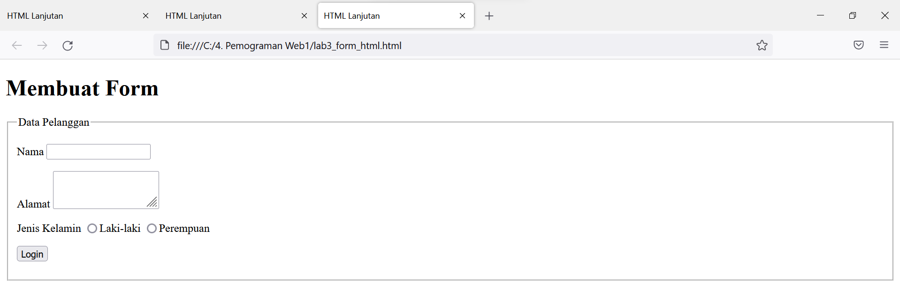

Kemudian tambahkan kode style untuk membuat tampilan form lebih menarik, seperti berikut:

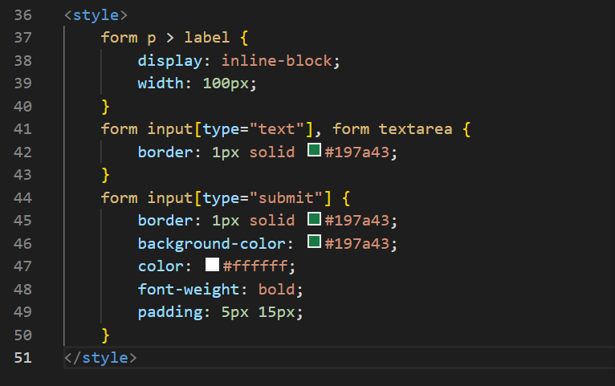

Perubahan style form pada browser
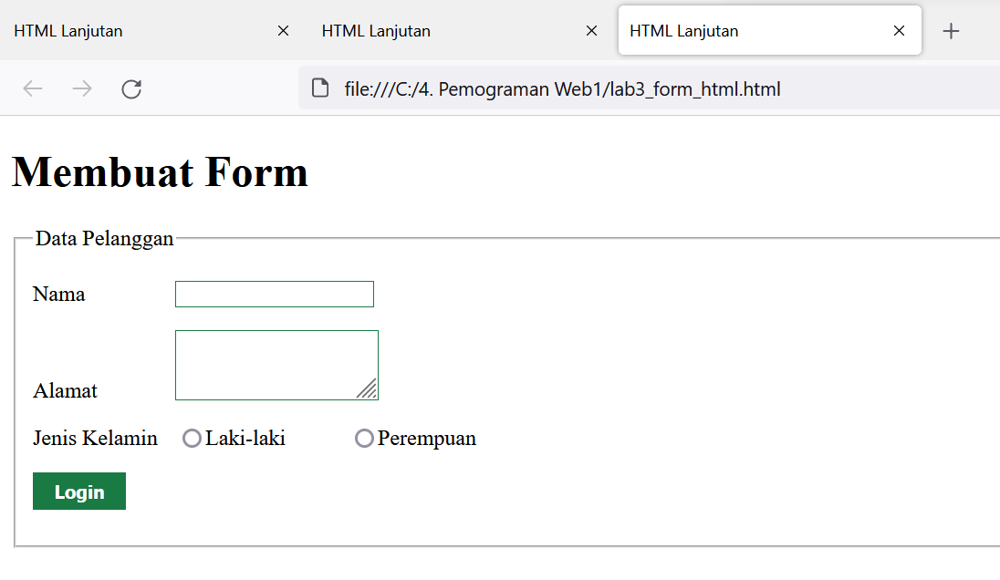

##### 4. TUGAS
#####   Buatlah form yang menampilkan dropdown menu dan listbox dengan multiple selection.
Tampilan kode select option untuk membuat form berisi menu dropdown dan listbox

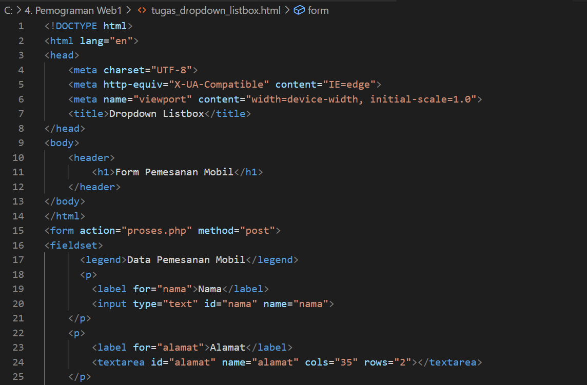
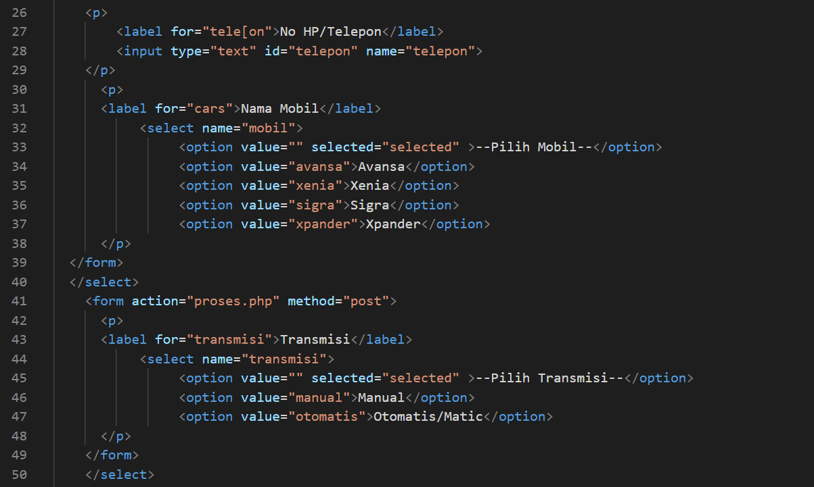
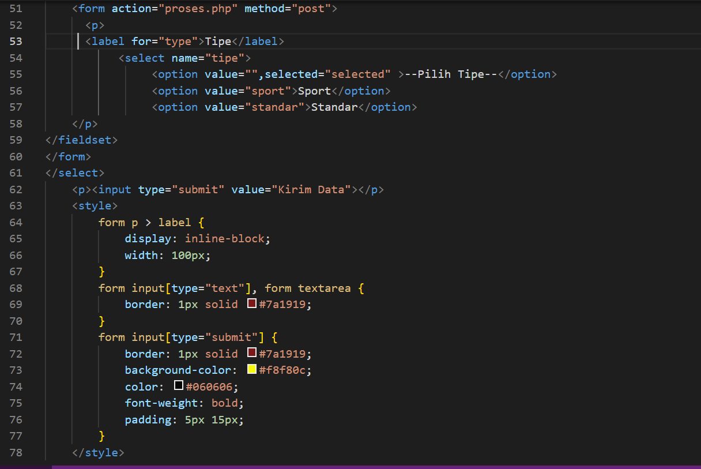

Tampilan form pada browser
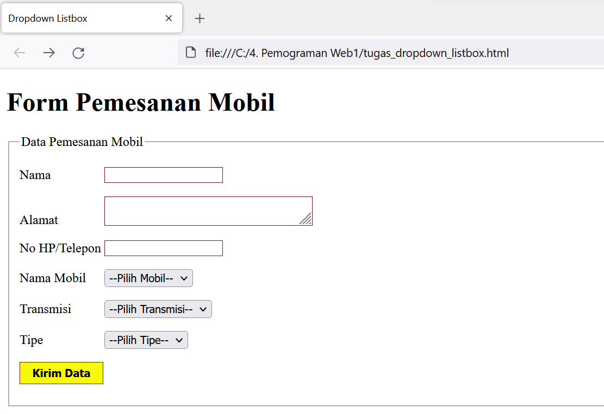
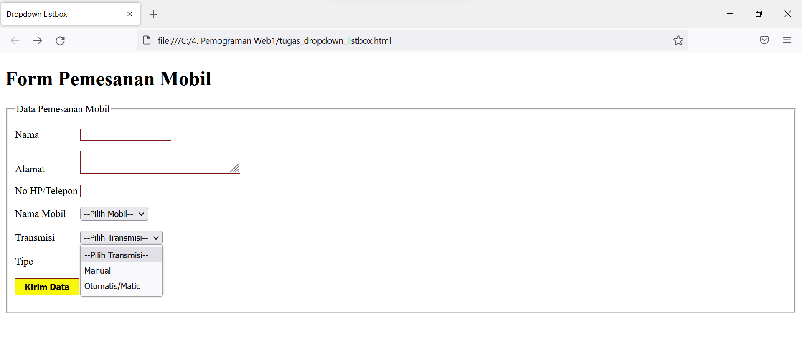

SEKIAN TUGAS YANG SAYA KERJAKAN, SEMOGA MEMBANTU. TERIMAKASIH

                                                                                TEKNIK INFORMATIKA 
                                                                                UNIVERSITAS PELITA BANGSA
                                                                                2022